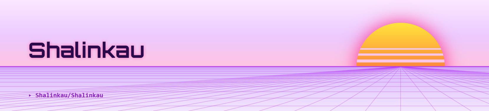

<!-- ============ BANNER ============ -->
<picture>
  <source media="(prefers-color-scheme: dark)" srcset="header-dark.png" />
  
</picture>

<!-- ============ TITLE ============ -->
# Qué pasa?, I'm SHALIN 🧛

 

<!-- ============ PROFILE BADGES ============ -->

  
  
  

<!-- ============ PIXEL CHARACTER ============ -->

  

<!-- ============ ABOUT ME ============ -->
## 🚀 About Me

<table width="100%" border="0">
<tr>
<td width="65%" valign="top" align="left">

I'm **SHALIN**, a **CS student** based in **Chennai, India**, passionate about building clean, efficient, and user-focused software.

- 🦇 **Title:** Grand Archmage of Null Pointers & Motion Arts
- 🔮 **Dark Disciplines:** Crafting cinematic cuts (*Video Editing*) & casting Image Encryption wards
- 🤖 **Forbidden Spells:** Conjuring AI familiars to auto-complete & refactor codebase rituals
- 📜 **Quest Log:** Venturing into the Vercel & Netlify Wastelands to summon cloud deployments
- 🩸 **Sustenance:** Cold Brew, render queues, and dark aesthetic edits
- 💀 **Phobia:** Sunlight, dropped frames, and untagged tags

</td>
<td width="35%" valign="top" align="center">

</td>
</tr>
</table>

<!-- ============ TECH STACK ============ -->
## 🛠️ Tech Stack

  

<!-- ============ GITHUB ANALYTICS ============ -->
## 📊 GitHub Analytics

<!-- ============ CONTRIBUTION SNAKE ============ -->
## 🐍 Contribution Snake

  <picture>
    <source media="(prefers-color-scheme: dark)" srcset="https://raw.githubusercontent.com/Shalinkau/Shalinkau/output/github-contribution-grid-snake-dark.svg" />
    <source media="(prefers-color-scheme: light)" srcset="https://raw.githubusercontent.com/Shalinkau/Shalinkau/output/github-contribution-grid-snake.svg" />
    
  </picture>

<!-- ============ CONNECT ============ -->
## 💌 Let's Connect

  

 

<!-- ============ FOOTER (PURPLE VAMPIRE THEME) ============ -->

  

